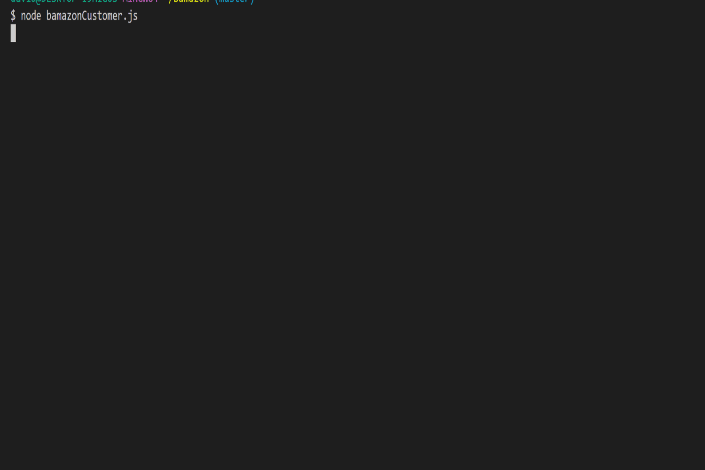

<h1>Bamazon</h1>


<hr>

Author:  David Levens


<hr>

<h3> App demo </h3>



<hr>


<h2> Project overview</h2>LIRI is a com
An Amazon-like CLI storefront built with mySQL, NODE.js and Inquirer NPM. Output styled with Colors and console.table NPM's. The app can take in orders from customers, calculate sales price and deplete stock from the store's inventory. Schema.sql and Seed.sql files have been included for database creation ranging in size from 15 to 100+
<hr>

<h2> How it works </h2>
Type into the command line....

- ```node bamazonCustomer.js ``` to start app

<hr>

<h2>Technology and packages used</h2>

[Node.js](https://nodejs.org/en/)

[colors](https://www.npmjs.com/package/cli-color)

[cli-table](https://www.npmjs.com/package/table)

[inquirer](https://www.npmjs.com/inquirer)

[mysql](https://www.npmjs.com/package/mysql)


<hr></hr>

<h4>Below is a brief desription of the node packages used to make the app work</h4>

- Navigate to root of project. Initialize package.json by running ```npm init -y```

- Creation of .gitignore file

- Creation of config.js to store connection information
  
- Creation of bamazonCustomer.js 


- ```npm install mysql```

- ```npm install inquirer```

- ```npm install table```

- ```npm install cli-color``` 

- run schema.sql as query to connect to MySql database and 'CREATE' bamazon-db

- run seeds-100.sql as query to connect to MySql database and seed data
  
- run node bamazonCustomer.js to run Bamazon app

- Color package used for style

- CLI-table package used to format rows and columns

- mysql package used to communicate with MySql database

- inquirer package used to prompt user input
